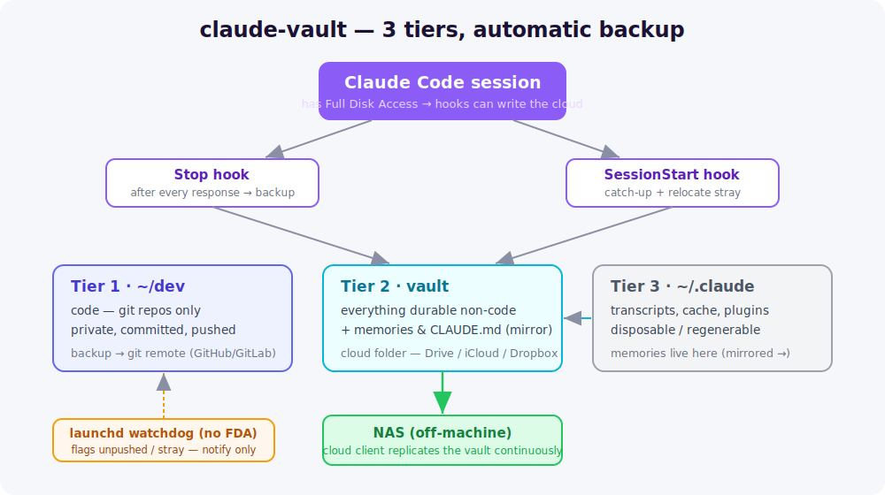

<p align="center">
  
</p>

<p align="center">
  
  
  
  
</p>

<p align="center">
  <b>Never lose your Claude Code work again.</b><br>
  A 3-tier storage policy + automatic backup: code in git, everything else in a cloud vault
  (→ your NAS), and nothing important stranded on a disk that can die.
</p>

---

## The problem

Claude Code silently accumulates valuable state you never think to back up:

- **Memories** (`~/.claude/projects/*/memory/`) — the durable knowledge Claude builds over months.
- A growing **global `CLAUDE.md`** — your rules, conventions, hard-won context.
- **Generated files** scattered wherever the session happened to write them.
- **Code** across many repos — some with uncommitted or **unpushed** work.

None of it is backed up by default. A disk failure, a bad automated edit, or a forgotten
unpushed branch = **lost work**.

## The idea — 3 tiers, one rule each

<p align="center"></p>

| Tier | What | Where | Backup |
|---|---|---|---|
| **1** | **Code** | `~/dev/` — git repos only, private, pushed | the git remote |
| **2** | **Everything durable non-code** | a **cloud vault** (Drive/iCloud/Dropbox) | cloud → your NAS |
| **3** | **The rest** (transcripts, cache…) | `~/.claude/` — disposable | none needed |

Memories and `CLAUDE.md` *have* to live in tier 3 (Claude Code reads them there) but are
**durable** — so they stay local **and** are mirrored to the vault automatically.

## The hard part — and the insight 💡

On macOS, **TCC** (the privacy system) blocks background jobs (`launchd`, `cron`) from writing
to a cloud folder like Google Drive or iCloud:

```
rsync: … /Google Drive/…: open: Operation not permitted
```

So a scheduled backup to your Drive **cannot work** — unless you grant *Full Disk Access* to
`/bin/bash` (broad and dangerous) or ship a signed helper app (heavy).

**claude-vault's trick: run the backup from a Claude Code hook.** A hook runs *inside* the
Claude Code process, which already holds Full Disk Access — so it can write the vault with **no
extra permission and no new attack surface**. Backups happen **on the fly** after every
response, and a catch-up runs at session start.

## How it works

| When | Mechanism | Does |
|---|---|---|
| After **every response** | `Stop` hook → `backup-durable.sh` | copies memories + `CLAUDE.md` → vault (on-the-fly) |
| At **session start** | `SessionStart` hook → `relocate.sh` | catch-up backup **+** relocates stray non-git out of `~/dev` **+** flags unpushed repos |
| **Between sessions** | `launchd` watchdog → `watchdog.sh` | passively flags unpushed repos / non-git in `~/dev` (desktop notification) |
| **Continuously** | your cloud client (Cloud Sync…) | replicates the vault to your NAS |

Hooks run with Claude Code's FDA (they *can* write the cloud). The watchdog runs headless via
launchd (it *cannot* — TCC), so it only **flags**; the hooks do the actual fixing.

## Install

```bash
git clone https://github.com/Beennnn/claude-vault.git
cd claude-vault
cp config.example.sh config.sh      # ← edit DEV_ROOT + VAULT_DIR for your machine
./install.sh                        # idempotent; re-run any time
```

`install.sh` copies the scripts, wires the two hooks into `~/.claude/settings.json`, installs
the launchd watchdog, and appends the policy to your `~/.claude/CLAUDE.md`.

## Configure your vault (any cloud)

`VAULT_DIR` just needs to be a folder inside a synced cloud drive:

```bash
# Google Drive
VAULT_DIR="$HOME/Library/CloudStorage/GoogleDrive-you@gmail.com/My Drive/claude"
# iCloud Drive
VAULT_DIR="$HOME/Library/Mobile Documents/com~apple~CloudDocs/claude"
# Dropbox
VAULT_DIR="$HOME/Dropbox/claude"
```

> **Tip:** mark the vault **"Available offline"** in your cloud client so it is never evicted
> to online-only.

## What it touches

- `~/.local/share/claude-vault/bin/` — the three scripts
- `~/.config/claude-vault/config.sh` — your paths
- `~/.claude/settings.json` — adds `Stop` + `SessionStart` hooks (existing hooks preserved)
- `~/Library/LaunchAgents/com.claude-vault.watchdog.plist` — the watchdog
- appends a policy block to `~/.claude/CLAUDE.md`

Nothing is deleted; relocations go to `vault/_relocated/` (quarantine). See
[`docs/architecture.md`](docs/architecture.md) for the full design and the TCC/FDA deep-dive.

## License

MIT — see [LICENSE](LICENSE).
